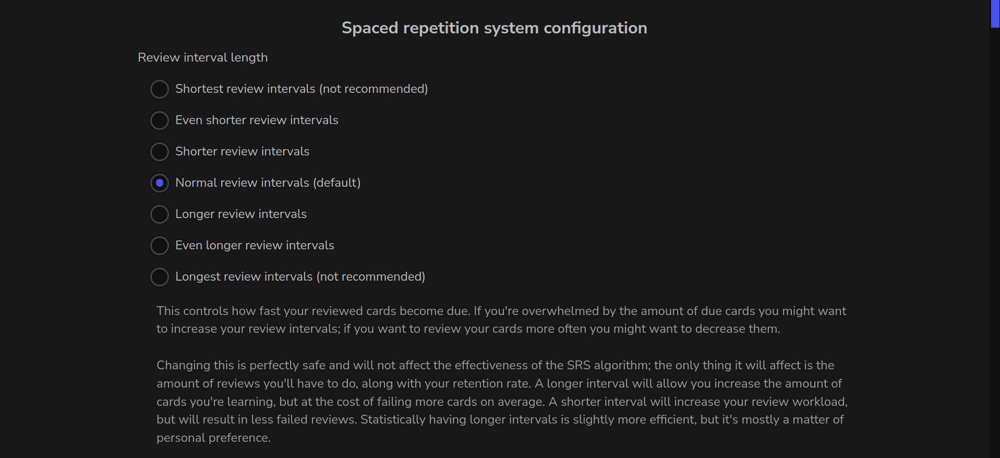
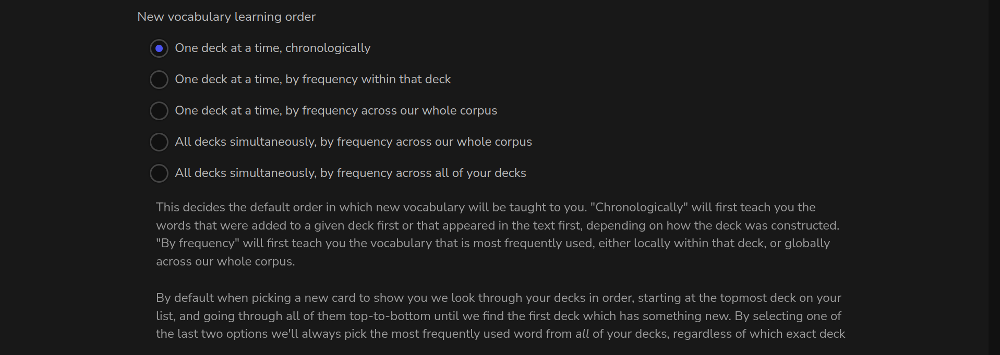
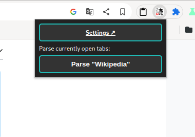
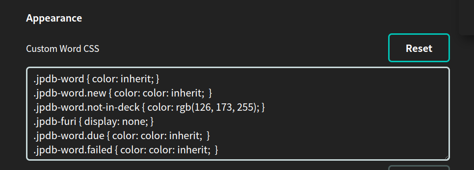
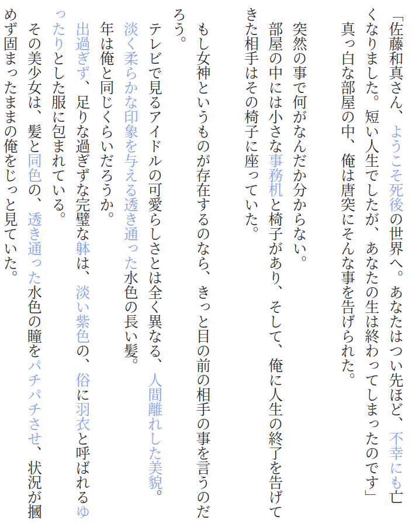
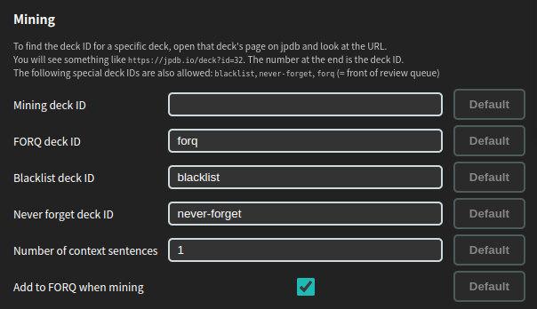
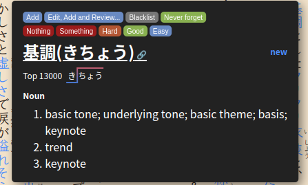

# Guía de JPDB

Hola, si estás aquí seguro te llamó la atención aventurarte a aprender japonés de una manera única, pero familiar... bueno bienvenido porque no vas a encontrar herramienta más **cómoda** y **sencilla** que JPDB. En pocas palabras, JPDB te va a servir principalmente para **2 cosas**:

**Aprender palabras**. Con el SRS de JPDB vas a poder aprender palabras en el orden que prefieras, mi orden favorito es el orden de frecuencia, dicho de otra forma, es el orden que tiene en cuenta la frecuencia con la que verás esas palabras que vas aprendiendo en tu inmersión. Igual puedes aprender palabras según su frecuencia dentro de una obra (novela, anime, novela visual, etc.) en específico si es lo que te interesa, es por eso que aprender palabras usando JPDB es muy eficiente.

**Elegir en que contenido inmersar**. JPDB tiene datos sobre diferentes obras, un apartado bastante conveniente dentro de estas es “**known words**” o palabras conocidas, esto te va marcar que porcentaje de vocabulario conoces de la obra en cuestión, eso te permitirá ver rápidamente la dificultad que vas a encontrarte a la hora de leerla ya que a más porcentaje de conocidas, más fluida será tu inmersión.

!!! note "Aviso importante"
    Debido a diferentes factores como el algoritmo utilizado por JPDB o el hecho de que es un servicio online de código cerrado, sigue siendo preferible utilizar anki para el aprendizaje de vocabulario. Sin embargo, JPDB es una herramienta muy útil para el mineo de palabras y frases, por lo que si ya tienes un propósito claro, quieres expandir tu conocimiento o quieres informarte sobre más herramientas. Así que eres libre de leerlo, probarlo y decidir por ti mismo.

## JPDB Setup

Mucha gente tiene dudas de cómo se usa JPDB, yo mismo tenía algunas dudas. Antes pensaba que hacías mazos de diferentes obras, pero no lo veía muy útil de ser así, pero JPDB usa su propia base de datos de palabras para asegurarse de que no estudies una misma palabra varias veces (a menos que sea <a href="#redundante">**redundante**</a>, esto será explicado más adelante), eso significa que solo te va a enseñar palabras útiles que se encuentran dentro de la base de datos.

Empezamos con las configuraciones principales. En “**review interval length**” (esto es lo que va a durar el intervalo entre reviews) yo recomendaría dejarla en default al principio, luego puedes modificarla si te interesa que las cartas te salgan con más o menos frecuencia, a mí personalmente no me gusta que me salgan tanto por lo que tengo los intervalos largos.

{width="100%"}

En “**new vocabulary learning order**” puedes poner el orden en el que quieres que te salga el vocabulario. Nunca recomendaría que sea cronológicamente, a menos de que lo vayas a usar para minar. De primeras lo recomendaría por frecuencia.

**Caso 1 (recomendado para principiantes)**: si quieres simplemente ver las cartas por la frecuencia en la que se usan en las obras de JPDB y tienes planeado consumir varias de ellas, yo te recomendaría elegir “_all decks simultaneosly, by frequency across our whole corpus_”. Esto yo se lo recomendaría a todos los que van a empezar con el japonés.

**Caso 2 (recomendado para estudiantes avanzados)**: si vas a minar te recomiendo dejarlo en "_one deck at a time, chronologically_", de esta manera te salen las cartas en el orden que las minas.

**Caso 3**: si lo que te interesa es entender lo máximo posible una sola obra, te recomendaría elegir “_one deck at a time, by frequency across the whole corpus_” o “_One deck at a time, by frenquency within that deck_”, el primero va a mostrarte vocabulario en orden de frecuencia considerando todas las obras pero solo el vocabulario que esté en ese deck, por ejemplo, la palabra 読み es muy frecuente, pero si la palabra no sale en el deck seleccionado, entonces no te la va a mostrar, la segunda opción es por orden de frecuencia dentro del deck, esta es la mejor forma de subir el coverage (known words) de un deck rápidamente. El deck que JPDB va a tomar es el que esté en lo más alto de tus mazos de JPDB.

**Caso 4 (no recomendado)**: las otras opciones ya no son tan recomendadas pero es posible que igual te puedan servir, así que te las voy a explicar de forma breve. Si quieres aprenderte el vocabulario de una obra en orden cronológico elige “_one deck at a time, chronologically_”. Si quieres aprender en orden de frecuencia entre todos tus decks elige “all decks simultaneously, by frequency across all your decks”. Estos no los recomiendo porque si los aprendes cronológicamente vas a ver muchas palabras que posiblemente solo son mencionadas una o dos veces y si lo haces en frecuencia de todos tus decks va a estar descompensado, digamos que tienes todos los arcos de one piece y un anime de 12 capítulos, antes que cualquier palabra de ese anime de 12 capítulos te van a salir mucho vocabulario de one piece como 海賊 (pirata) o 麦わら (paja). Esto lo digo porque ya me pasó jajaja.

{width="100%"}

En “**review session configuration**” pon lo que consideres. “**Review session length**” son lo minutos que deben pasar para que te diga que ya acabaste la sesión. Aunque la sesión finalize, JPDB te permite seguir adelante con tu estudio si así lo quieres, esto yo lo veo útil por si te gusta tomar descansos después de cierto tiempo haciendo SRS. Y en “**cards per review session**” debes poner cuantas cartas nuevas aprender al día, yo he experimentado que hacer nuevas cartas en JPDB es más sencillo que en Anki, al menos tengo esa sensación, entonces te recomiendo hacer de 15 a 30, ya tú eliges si quieres hacer más o menos según tus circunstancias personales. Si ya eres un estudiante más avanzado, aquí te recomiendo no hacer tantas y dedicar más tiempo a la lectura.

{width="100%"}

## Guía principiantes

¿Eres principiante y quieres empezar a minar? Para eso necesitas aproximadamente 1000 palabras en JPDB, entonces ahora te voy a explicar paso a paso como conseguir estas 1000 palabras.

Primero debes empezar a añadir mazos, solo tendrás que darle a “ **built-in decks**” y buscar obras que te interesen. Yo te recomiendo añadir de 5 a 15 mazos basándote en 2 cosas: Las ganas que tengas de consumir esa obra y la cantidad de palabras que tiene. Te recomiendo añadir obras con muchas palabras para que abarque gran cantidad del vocabulario básico y común japonés. Yo añadiría novelas, ya sean light novels o visual novels ya que suelen tener mucho vocabulario.

¿Cuántas palabras totales son suficientes? Yo diría que aproximadamente unas 20k estarían bien, no tienes por qué estudiarlas todas, pero así cubres una cantidad considerable, no te recomiendo hacer muchas más si te interesa minar porque JPDB tiene un límite de cartas. Cuando acabes de añadir palabras y quieras ir al mineo, puedes borrar todos esos mazos que pusiste, siguiendo los pasos de la sección de <a href="#TODO-DE-ARMORY">**borrar mazos**</a>.

Si tienes más dudas sobre como empezar en JPDB si eres principiante, pregunta en el servidor de discord, con gusto te ayudamos.

!!! Warning "Aviso importante"
    No olvides usar el orden de frecuencia, como fue especificado en la sección anterior.

## Atajos

Durante los repasos diarios, el hecho de tener que mover el ratón hacia los botones de respuesta puede llegar a ser muy lento. Por ello, te voy a enseñar algunos atajos para que puedas hacer tus repeticiones de forma más rápida.

{width="100%"}

Cuando estás aquí, debajo del “Okay” podrás ver una línea, eso significa que el botón está seleccionado y para pulsarlos solo deberás pulsar espacio. Para moverte por las demás opciones puedes usar los números: 1. Nothing 2. Something 3. Hard 4. Okay y 5. Easy. Una vez tengas seleccionado uno de ellos solo le das espacio para pulsarlo. Esto hace que hagas las repeticiones de forma mucho más rápida.

!!! note "Nota"
    Cuando tienes el modo de 2 botones en los ajutes de JPDB funciona igual: 1. Fail 3. Pass.

## Palabras redundantes

Seguramente has visto algunas palabras etiquetadas como “redundantes”, estas palabras son simplemente palabras que significan lo mismo que otras, pero se escriben de forma diferente. Por ejemplo: 私, わたし y ワタシ.

{width="100%"}
En alt forms puedes ver las distintas formas en las que se escribe una palabra.

## Vocabulary y Coverage

En cada uno de tus decks vas a ver 2 barras, vocabulary y coverage. Vocabulary es el porcentaje de cartas aprendidas considerando todas las palabras del deck sin repetirse y coverage el porcentaje de cartas aprendidas considerando todas las palabras.

Ejemplo:

    私は
    マンガを
    たくさん
    読みます。
    私は
    たくさん
    本を
    読みます。

Aquí hay 5 palabras diferentes: 私, マンガ, たくさん, 読みます y 本. Vocabulary es el porcentaje de palabras que sabes entre esas 5. Por ejemplo, digamos que no conozco マンガ, entonces al conocer 4 de 5 sacas el porcentaje que conoces, (1 / 5) * 100 sería 20 y eso se lo restas a 100. Entonces el porcentaje de palabras que conoces sería 80% en vocabulary. Mientras que en coverage son las palabras que conoces sin importar que estas se repitan, entonces debemos contar todas las palabras que hay, son 8 contando las que se repiten y de esas 8 seguimos sin conocer solo 1, マンガ, entonces sería la misma cuenta pero ahora el total siendo 8 entonces (1 / 8) * 100 sería 12.5 y se lo restas a 100, eso da 87.5. Entonces en este caso el vocabulary sería de 80% y el coverage de 87.5%.

{width="100%"}
{width="50%"}

Y eso sería todo, en general funciona como un SRS normal pero las palabras son directamente sacadas de obras, haciendo tu inmersión más efectiva ya que las palabras que aprendes las vas a ver en tu inmersión.

Pero eso no es todo, ya que aún puedes hacerlo más útil y esto que voy a mostrar es mi cosa favorita sobre JPDB y lo que me ha ayudado a mejorar bastante y principalmente a sentirme más cómodo leyendo, así que puedes dejarlo hasta ahí y usarlo como SRS o ir más allá. Yo te recomiendo seguir.

## Sentence Mining

Hemos llegado a donde todos estaban esperando, sentence mining en JPDB, es un tema un poquito largo, pero no hay problema solo presta atención.

### JPDBreader

JPDBreader es la famosa herramienta, esta te va a ayudar con muchas cosas como minar, agregar palabras que ya conoces y ver la frecuencia de una palabra, todo esto mientras lees, ya que con esto podrás usar el diccionario y herramientas de JPDB como diccionario integrado. El beneficio principal que le encontré es que, al saber qué palabras no conozco, automáticamente abro el diccionario al verlas sin romperme mucho la cabeza intentando recordar y ver que palabras nuevas puedo añadir a mi mazo de estudio.

Para instalarla solo entra a [su repositorio de github](https://github.com/max-kamps/jpd-breader) ahí aparecen las instrucciones, cualquier duda la comentas en el servidor de discord.

#### Configuración

Una vez ya tienes la extensión debes añadir tu API Key de JPDB en la configuración de la extensión. Ahí mismo te saldrá un link para encontrar tu API, solo cópiala y pégala en el recuadro.

{width="100%"}

Teniendo activada la extensión, debería funcionar automáticamente en cualquier página que contenga texto y soporte. Pero si no, simplemente debes darle click a la extensión y darle al botón de “parse”.

{width="50%"}

La extensión por defecto se ve tal que así:

{width="40%"}

palabras nuevas   
palabras conocidas  
palabras falladas  
palabras ocultas (blacklisted)\*  
palabras que estás aprendiendo  

!!! note "Blacklisted"
    Las palabras ocultas son palabras que JPDB va a ignorar y no va a considerar en los decks, yo personalmente no te recomiendo ocultar ninguna, JPDB automáticamente oculta palabras escritas en katakana que se parecen demasiado al inglés o partículas, con eso debería ser suficiente.

Muy bonito y colorido todo... Pero realmente no te recomiendo usarlo con ese aspecto, yo realmente solo veo útil tener el color de las que no tienes en tu mazo de mineo, yo tengo todas las palabras sin modificar a excepción de esas. Esto es porque no siempre lo vas a ver todo tan colorido y de esta forma tener esa sensación de que entre más palabras conozcas, más normal vas a ver todo. Cuando ya tengas mucho vocabulario solo pocas palabras son las que se van a poner de color, no sé, a mí me da una gran motivación.

Para modificar los colores tienes que entrar a los ajustes e ir a la opción “**appearance**”. Aquí puedes agregar código CSS para modificar el color de las palabras, este debe ser agregado en “**custom word css**”.

{width="100%"}

De esta forma yo le quito el color a todas las palabras que no sean las nuevas y elimino el furigana en todas las palabras. Esto es lo que recomiendo, pero tú puedes ir modificándolo a tu gusto, si quieres más información puedes visitar el repositorio oficial de JPDBreader.
https://github.com/max-kamps/jpd-breader

A mí con todo configurado me queda algo así:

{width="100%"}

!!! note "Nota"
    Algunos furigana no desaparecen porque ya vienen con la novela, se puede quitar con ttsu reader pero recomiendo dejarlos.

Ahora para empezar a minar debes primero configurar estas opciones:
{width="100%"}

La mayoría ya están preparadas y no deberías tener ningún problema dejándolo por defecto. Lo único que debes hacer es agregar el “**mining deck id**”, este es el deck donde quieres que vayan las palabras que vas minando. Para encontrarlo solo debes ir a tus decks, crear uno si no tienes uno donde meterlas y en la URL vas a encontrar el ID de este.

{width="100%"}

En este caso el mío es el número 89.

Ahora puedes poner el cursor encima de una palabra mientras pulsas la tecla shift y te va a saltar un popup con información de esa palabra, luce de esta forma:

{width="100%"}

Para minar solo debes de dar click en “add” en caso de no tener la palabra en ninguno de tus mazos. Pero digamos que ya tienes la palabra en uno de tus mazos y quieres que te salga en tus repeticiones, para eso hay otras opciones pero yo solo te recomiendo usar los botones de “Blacklist”, “Never forget”, “Good” y “Nothing”, así puedes agregar palabras que ya conoces pero no las aprendiste usando el srs de JPDB, puedes ocultar las palabras para que ya no te salgan en el SRS y puedes poner que una palabra no la conoces pero aun así quieres verla en tus repeticiones respectivamente.

Teniendo esto listo ya deberías ser capaz de leer usando la extensión, hay muchas más configuraciones pero es difícil cubrirlas todas, pero puedes preguntar y posiblemente tu duda sea resuelta, ya sea en el servidor de JPDB o Manabe. Y como lector de epubs yo te recomiendo usar ttsureader, funciona perfectamente y puedes ponerle un diseño bastante bonito.

!!! Warning Aviso importante
    Desactiva la casilla de FORQ, porque en caso de estar marcada te va a priorizar esas cartas, eso suena como algo positivo pero no lo es, de esta forma no vas a tener tanto control de en qué orden quieres hacer tu mazo.

### Jpdb-connect

Si quieres minar usando yomichan, es más sencillo, solo revisa [este repositorio de github](https://github.com/kampffrosch94/jpdb-connect). Si tienes duda en la configuración, pregunta en el servidor de discord.

Por ahora aquí termina esta pequeña guía sobre JPDB, como ya repetí hasta el cansancio, si necesitas más ayuda con esto, pregunta en el servidor. Les mando un saludo su amigo Armory. Quiero también agradecer a Xyaman por su apoyo en la creación de esta guía.

Escrita por armoryfour

